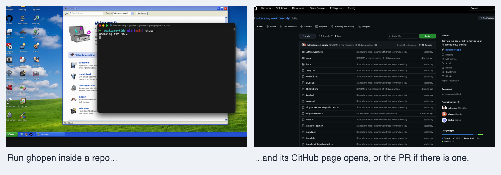
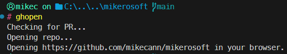

#  ghopen

Open the repo you're in on GitHub, or its pull request if there is one

Windows · macOS

<!-- media: hero -->


[Watch it run (9 seconds)](docs/demo.mp4)
<!-- /media: hero -->

## What it is

Run `ghopen` from anywhere inside a git repo and it opens it on GitHub in your browser. If the branch you're on has a pull request it opens that instead, which is usually what I actually wanted.

It works in any repo. PR detection uses the optional GitHub CLI. Without it, `ghopen` opens the repo root using the `origin` remote instead.

## Get it

Paste this into your AI coding agent (Claude Code, Codex, Cursor...):

> Clone https://github.com/mikecann/ghopen and make it my own. It's one of Mike
> Cann's personal tools, so read the README first, change anything specific to his
> setup to suit mine, then help me get it running.

### Or set it up by hand

You'll need Git and a browser. macOS uses Bash and the native `open` command. Windows uses CMD and PowerShell. I recommend installing the [GitHub CLI](https://cli.github.com/) for PR detection.

Clone the repo somewhere you plan to keep it:

```sh
git clone https://github.com/mikecann/ghopen.git
cd ghopen
```

On macOS:

```sh
brew install gh
gh auth login
bash install.sh
```

The installer links `ghopen` into `~/.local/bin`. If that directory isn't on PATH, add this to your shell profile, such as `~/.zshrc`, then open a new terminal:

```sh
export PATH="$HOME/.local/bin:$PATH"
```

You can pass a different destination, for example `bash install.sh "$HOME/bin"`. `setup_mac.sh` still works as an alias for the installer.

On Windows, run these from PowerShell in the clone:

```powershell
winget install GitHub.cli
gh auth login
powershell -NoProfile -ExecutionPolicy Bypass -File .\install.ps1
```

If you've just installed `gh`, open a new terminal before running `gh auth login`. Add `C:\dev\tools` to your user PATH if it isn't already there. The installer writes CMD and Git Bash stubs there and adds **Mike's Tools > Open on GitHub** to Explorer's folder and folder-background menus. It checks for `gh` through `deps.ps1`; pass `-SkipDeps` to skip that check. The registry changes apply to your user account.

There are no API keys or `.env` settings. GitHub CLI handles authentication through `gh auth login`. Both installers point at this clone, so keep it around and re-run the installer if you move it.

## Using it

From any directory inside a git repo:

```sh
ghopen
```

No arguments needed. On Windows you can also right-click a folder or the background inside an open folder and choose **Mike's Tools > Open on GitHub**. On Windows 11, choose **Show more options** first to reach the classic menu.

## Behaviour

| Situation | What opens |
|---|---|
| On a branch with a PR, with `gh` available | The PR page on GitHub |
| On another branch, with `gh` available | The repository home page |
| `gh` not installed | The repo root, parsed from the `origin` remote URL |

The macOS launcher also tries the remote URL fallback if both GitHub CLI commands fail. The Windows launcher uses that fallback when `gh` isn't installed.

## Screenshots




## Troubleshooting

- **Not a git repository:** run the command from inside a Git checkout.
- **No origin remote found:** add an `origin` remote, or install and authenticate `gh` so it can find the repo.
- **Not a GitHub remote:** the fallback expects a github.com remote, over SSH or HTTPS, pointing at `owner/repo`. It doesn't handle other hosting services or GitHub Enterprise.
- **Command not found:** check that the install directory is on PATH, then open a new terminal.
- **PRs aren't opening:** check `gh auth status`. Without a working GitHub CLI, PR detection isn't available.

The optional `GHOPEN_OPEN_COMMAND` environment variable selects a different browser opener for the Bash launcher. Its value must be a command name or executable path, without extra arguments.

## Uninstalling

On macOS:

```sh
bash uninstall.sh
```

If you used a custom install directory, pass the same directory to `uninstall.sh`. It removes only the symlink pointing at this clone.

On Windows:

```powershell
powershell -NoProfile -ExecutionPolicy Bypass -File .\uninstall.ps1
```

This removes the `ghopen` stubs, its generated icon and its two Explorer entries. It leaves the shared **Mike's Tools** submenu and other tools' entries in place.

## Development

```sh
bash run-tests.sh
bash run-install-tests.sh
pwsh -NoProfile -File ./run-install-tests.ps1
```

The command tests use fake Git, GitHub CLI and browser commands, so they don't open tabs. The macOS installer tests use a temporary destination. The PowerShell tests parse every `.ps1`, check stub and icon generation, and on Windows test install and uninstall with temporary files and an isolated registry subtree. CI runs these checks on macOS and Windows without secrets.

## More tools

You can find my other tools at [mikerosoft.app](https://mikerosoft.app).

MIT licensed.
